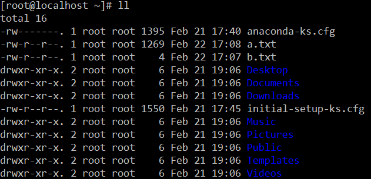

# Linux命令

### 创建和删除文件夹的命令：

* ##### `mkdir`：创建文件夹

* ##### `rmdir`：删除文件夹

### 浏览文件：

* ##### `cat`：用于显示文件的内容。格式：`cat[参数]<文件名>`

* ##### `more`：一般用于要显示的内容会超过一个画面长度的情况

  * 空格显示下一页数据 回车显示下一行的数据
  * q是退出查看

* ##### `less`：`less`用法和`more`类似，不同的是less可以通过`PgUp`、`PgDn键`来控制。

  * `PgUp `和` PgDn `进行上下翻页.

* ##### `tail`：用于显示文件后几行的内容。

  * 用法：`tail -10 a.txt` ： 查看后10行数据

### 文件操作：

* ##### `rm`：移除文件

  * 用法：`rm [选项]... 文件...`
  * `rm a.txt`  删除a.txt文件，删除需要用户确认，y/n 
  * `rm -f a.txt ` 不询问，直接删除目录
  * `rm -r a `  递归删除不询问递归删除（慎用）
  * `rm -rf  a`  不询问递归删除
  * `rm -rf *`  删除所有文件
  * `rm -rf /* `  自杀

* ##### `cp`：复制文件

  * `cp a.txt b.txt` 将a.txt复制为b.txt文件
  * `cp a.txt ../` 将a.txt文件复制到上一层目录中

* ##### `mv` 移动或者重命名

  * `mv a.txt ../` 将a.txt文件移动到上一层目录中
  * `mv a.txt b.txt` 将a.txt文件重命名为b.txt

* ##### `tar`：打包或解压文件

  * -c：创建一个新tar文件
  * -v：显示运行过程的信息
  * -f：指定文件名
  * -z：调用`gzip`压缩命令进行压缩
  * -t：查看压缩文件的内容
  * -x：解开tar文件
  * 打包：`tar –cvf xxx.tar ./*`
  * 打包并且压缩：`tar –zcvf xxx.tar.gz ./* `
  * 解压  `ar –xvf xxx.tar tar -zxvf xxx.tar.gz -C /usr/aaa`

* ##### `find`：用于查找符合条件的文件

  * `find / -name “ins*”` 查找文件名称是以ins开头的文件
  * `find / -name “ins*” –ls `
  * `find / –user xxx ls`查找用户xxx的文件
  * `find / –user xxx –type d –ls` 查找用户xxx的目录
  * `find /-perm -777 –type d-ls`查找权限是777的文件

* ##### `grep`：查找文件里符合条件的字符串

  * `grep [选项]... PATTERN [FILE]...`
  * `grep lang anaconda-ks.cfg` 在文件中查找`lang`
  * `grep lang anaconda-ks.cfg –color` 高亮显示

### 其他命令：

* ##### `pwd`：显示当前所在目录

* ##### `touch`：创建一个空文件

* ##### `clear` / Ctrl+L：

### 命令`ll`下的文件类型和权限：

* ##### 带表的文件类型

  * `-`表示文件
  * `d`表示文件夹
  * `l`表示连接

* ##### 当前用户具有的改文件权限

  * `r`：read 读
  * `w`：write 写
  * `x`：excute 执行

* ##### 当前组内其他用户具有该文件的权限

  * `r`：read 读
  * `w`：write 写
  * `x`：excute 执行

* ##### 其他组内成员用户具有的该文件的权限

  * `r`：read 读
  * `w`：write 写
  * `x`：excute 执行

  ​	

* ##### 例如：

  ```shell
  #-rw-r--r--. 1 root root 1269 Feb 22 17:08 a.txt
  # - 是指文件类型是文件
  # rw- 是指当前用户具有的权限：可读，可写，不可执行
  # r-- 是指当前组内其他用户具有该文件的权限：可读，不可写，不可执行
  # r-- 是指其他组内成员用户具有该文件的权限：可读。不可写，不可执行
  ```

* ##### 修改权限：

  ```shell
  # 1.第一种方法
  chmod u=yuer,g=rw,o=rx a.txt
  # u是当前用户，g是当前组内用户，o是其他组内用户
  
  # 2.第二种方法(快捷)
  # r --> 4
  # w --> 2
  # x --> 1
  chmod 765 
  # 三组权限：
  # 7=4+2+1：可读，可写，可执行；
  # 6=4+2：可读，可写，不可执行；
  # 5=4+1：可读，不可写，可执行；
  ```

### Linux常用的网络操作

* ##### 主机名配置

  * `hostname`：查看主机名
  * `homename xxx`修改主机名为xxx，重启后失效
  * 若想永久生效，可以修改`etc/sysconfig/network`文件

* ##### IP地址配置

  ```reStructuredText
  ifconfig 查看(修改)ip地址(重启后无效)
  ifconfig eth0 192.168.12.22 修改ip地址
  如果想要永久生效
  修改 /etc/sysconfig/network-scripts/ifcfg-eth0文件
  DEVICE=eth0 #网卡名称
  BOOTPROTO=static #获取ip的方式(static/dhcp/bootp/none)
  HWADDR=00:0C:29:B5:B2:69 #MAC地址
  IPADDR=12.168.177.129 #IP地址
  NETMASK=255.255.255.0 #子网掩码
  NETWORK=192.168.177.0 #网络地址
  BROADCAST=192.168.0.255 #广播地址
  NBOOT=yes #  系统启动时是否设置此网络接口，设置为yes时，系统启动时激活此设备。
  ```

* ##### 域名映射

  ```reStructuredText
  /etc/hosts文件用于在通过主机名进行访问时做ip地址解析之用,相当于windows系统的C:\Windows\System32\drivers\etc\hosts文件的功能
  ```

  

* ##### 网络服务管理

  ```reStructuredText
  service network status 查看指定服务的状态
  service network stop 停止指定服务
  service network start 启动指定服务
  service network restart 重启指定服务
  
  service --status–all 查看系统中所有后台服务
  netstat –nltp 查看系统中网络进程的端口监听情况
  
  防火墙设置
  防火墙根据配置文件/etc/sysconfig/iptables来控制本机的”出”、”入”网络访问行为。
  service iptables status 查看防火墙状态
  service iptables stop 关闭防火墙
  service iptables start 启动防火墙
  chkconfig  iptables off 禁止防火墙自启
  ```
  

# Linux的软件安装

*  Linux上的软件安装有以下几种常见方式介绍
    1. 二进制发布包
       * 软件已经针对具体平台编译打包发布，只要解压，修改配置即可
    2. RPM包
       * 软件已经按照`redhat`的包管理工具规范RPM进行打包发布，需要获取到相应的软件RPM发布包，然后用RPM命令进行安装
    3. Yum在线安装
       * 软件已经以RPM规范打包，但发布在了网络上的一些服务器上，可用yum在线安装服务器上的rpm软件，并且会自动解决软件安装过程中的库依赖问题
    4. 源码编译安装
       * 软件以源码工程的形式发布，需要获取到源码工程后用相应开发工具进行编译打包部署。
    
*  上传和下载工具介绍

    1. FileZilla

       

    2. lrzsz

       * 我们可以使用yum安装方式安装 yum install lrzsz
       * 注意：必须有网络
       * 可以在crt中设置上传与下载目录

       

       * 上传：

         

       * 下载：

         

    3. sftp:

       * 使用alt + p 组合键打开sftp窗口

         

       * 使用put 命令上传

         

       * 使用get命令下载

         

## 1. 安装JDK

1. 【步骤一】：上传JDK到Linux的服务器.

   * 上传JDK

   * 卸载open-JDK

   ```shell
   # 查看jdk版本
   
   java –version
   
   # 查看安装的jdk信息
   
   rpm -qa | grep java
   
   # 卸载jdk
   
   rpm -e --nodeps java-1.6.0-openjdk-1.6.0.35-1.13.7.1.el6_6.i686
   
   rpm -e --nodeps java-1.7.0-openjdk-1.7.0.79-2.5.5.4.el6.i686
   ```

2. 【步骤二】：在Linux服务器上安装JDK.

   * 通常将软件安装到`/usr/local`

   * 直接解压就可以

   ```shell
   tar –xvf jdk.tar.gz -C /usr/local/jdk/
   ```

3. 【步骤三】：配置JDK的环境变量.

   * 配置环境变量：

     * `vi /etc/profile`
     * 在末尾行添加

     ```shell
       # set java environment
     
       JAVA_HOME=/usr/local/jdk/jdk1.8.0_241
     
       CLASSPATH=.:$JAVA_HOME/lib.tools.jar
     
       PATH=$JAVA_HOME/bin:$PATH
     
       export JAVA_HOME CLASSPATH PATH
     保存退出
     ```

     * `source /etc/profile` 使更改的配置立即生效

## 2. 安装MySQL

1. 【步骤一】：将`mysql`的安装文件上传到Linux的服务器

   * 卸载系统自带的MySQL：

     ```shell
     # 查看已安装的mysql
     rpm -qa | grep -i mysql
     # 卸载mysql
     yum remove mysql-community-server-5.6.36-2.el7.x86_64
     #或者
     rpm -e --nodeps mysql-community-server-5.6.36-2.el7.x86_64
     #查看mysql的其它依赖：
     rpm -qa | grep -i mysql
     ```

   * 解压MySQL

     ```shell
     tar -xvf mysql-8.0.19-1.el8.x86_64.rpm-bundle.tar
     ```

2. 【步骤二】：安装MYSQL服务端

   * 