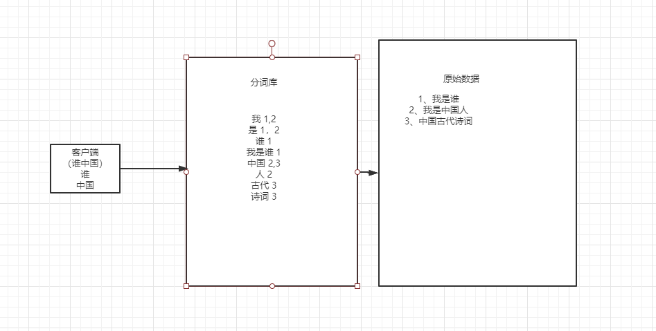

# Elasticsearch

### 一、序章

1. 解决了海量数据的模糊问题，比数据库效率提高很多。
2. 实现基于分词的全文检索。
3. 搜索关键字，高亮显示，便于我们展示与处理。

### 二、ES概述

#### 2.1 简介

- ES使用Java开发，基于Lucene的一个搜索引擎框架，提供了分布式的全文检索功能，提供了一个统一的Restful的web接口，官方客户端支持多种语言。

#### 2.2 ES和Solr的区别(面试题)

1. Solr对于经常变化的数据，检索效率会下降，ES的速度基本不变。Solr不适合做实时查询。
2. Solr做集群配置的时候需要其他组件的支持，Zookeeper。
3. ES中文资料较为完善。
4. ES支持云计算大数据。

#### 2.3 什么是倒排索引

* 将存放的数据以一定方式（算法）进行分词，并且将分词的内容放在分词库中。当用户检索数据的时候，将用户的检索关键字进行分词，然后去分词库中进行检索，匹配内容，最终得到数据的ID，根据ID去存放的位置拉取指定的数据。



### 三、Elasticsearch安装

#### 3.1 Linux安装ES&Kibana

- `docker-compose.yml`

  ```yaml
  version: "3.1"
  services:
    elasticsearch:
      image: daocloud.io/library/elasticsearch:6.5.4
      restart: always
      container_name: elasticsearch
      ports:
        - 9200:9200
    kibana:
      image: daocloud.io/library/kibana:6.5.4
      restart: always
      container_name: kibana
      ports:
        - 5601:5601
      environment:
        - elasticsearch_url=http://192.168.199.109:9200
      depends_on:
        - elasticsearch
  ```

#### 3.2 安装IK分词器

- 下载IK分词器的地址：https://github.com/medcl/elasticsearch-analysis-ik/releases/download/v6.5.4/elasticsearch-analysis-ik-6.5.4.zip

- 由于网络问题，采用国内的路径去下载：http://tomcat01.qfjava.cn:81/elasticsearch-analysis-ik-6.5.4.zip

- 进去到ES容器内部，跳转到bin目录下，执行bin目录下的脚本文件：

- ./elasticsearch-plugin install http://tomcat01.qfjava.cn:81/elasticsearch-analysis-ik-6.5.4.zip

- 重启ES的容器，让IK分词器生效。

### 四、基本操作

#### 4.1 ES结构

##### 4.1.1 索引Index，分片和备份

- ES服务中，可以创建多个索引
- 每个索引默认被分成5片存储
- 每个分片都会存在至少一个备份分片
- 备份分片默认不会帮助检索数据，当ES检索压力特别大的时候，备份分片才会帮助检索数据
- 备份分片必须放在不同的服务器中

##### 4.1.2 类型 Type

- 一个索引下可以创建多个类型

  > tips:版本不同，类型的创建也不同

##### 4.1.3 文档Doc【】