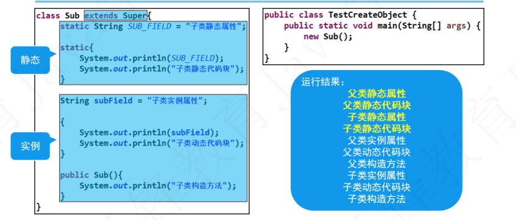

## 学习细节

### 计算机英语

| English  | 译                      |
| -------- | :---------------------- |
| modify   | vt. 修改，修饰；更改    |
| interval | n. 间隔；间距；幕间休息 |
| extends  | v. 延伸；扩充；继承     |
| contains | v. 包含，容纳；         |

### +=隐含强制类型转换

```java
int i = 1;
byte j = 1;
j = (int)(j + i); //需要手动进行强制类型装转换
j += i;//+=已经隐含强制类型转换
```

### 布尔类型的变量名，建议不使用is开头

类中布尔类型的变量名，建议不使用is开头。因为布尔类型变量在使用编译器和框架时，生成的方法和is开头的变量冲突。


### 随机数的灵活使用

```java
int number = new Random().nextInt(900000)+100000;//从100000到999999
```

### 封装

为了程序的安全性，将属性和方法封装起来，只保留部分方法或属性供外部使用

### 继承

子类可以使用父类的属性和方法，非private修饰。

### 访问修饰符

|           | 本类 | 同包 | 跨包子类 | 其他 |
| --------- | ---- | ---- | -------- | ---- |
| private   | √    | ×    | ×        | ×    |
| default   | √    | √    | ×        | ×    |
| protected | √    | √    | √        | ×    |
| public    | √    | √    | √        | √    |

### 多态

条件：

1. 继承

2. 重写

3. ``` java 
   Super p = new Sub();//语法满足
   ```

```java
Animal animal = new Dog();//使用父类引用，会丢失子类的属性和方法--将子类赋值给父类引用
animal.eat();//多态后，调用的方法仍然是子类重写后的方法--没有重写使用的是父类方法，重写后，使用子类的方法
```

#### 向上转型

```java
public class TestConvert {
	public static void main(String[] args) {
		Animal a = new Dog();//父类引用中保存真实子类对象，称为向上转型(即多态核心概念)
}
class Animal{
	public void eat(){
		System.out.println("动物在吃...");
	}
}
class Dog extends Animal{
	public void eat(){
		System.out.println( "狗在吃骨头...");
	}
}
```

#### 向下转型

```java
public class TestConvert {
	public static void main(String[] args) {
		Animal a = new Dog();
        Dog dog = (dog)a;//将父类引用中的真实子类对象，强转回子类本身类型，称为向下转型。
}
class Animal{
	public void eat(){
		System.out.println("动物在吃...");
	}
}
class Dog extends Animal{
	public void eat(){
		System.out.println( "狗在吃骨头...");
	}
}
```

#### `instanceof`关键字

用于判断引用中对象的真实类型，保证类型转换的正确性。

### 重写

返回值，方法名和参数类型一致，访问控制符可不同(要求子类比父类宽泛)。

### 重载

方法名相同，参数列表不同。

### abstract关键字

被abstract修饰的类是抽象类，无法被实例化

### static关键字

##### 静态代码块

* 只有在类加载的时候才会执行静态代码块

* 第一次new 子类的执行顺序，其中高亮部分只有在第一次new 子类触发类加载时候会执行。



### 内部类

#### 成员内部类

* 内部类里可以访问到外部的私有属性和私有方法。

* 当外部类和内部类的变量名相同的时候，优先访问内部类的变量。
* 成员内部类中无法定义静态成员。

#### 静态内部类

* 不依赖外部类对象，可以直接创建或者通过类名访问，可声明静态成员。

#### 局部内部类

* 定义在外部类的方法中，作用范围和创建对象范围仅限当前方法。
* 局部内部类访问外部类当前方法中的局部变量时，因为无法保障变量的生命周期与自身相同，因此变量需要修饰为final。

#### 匿名内部类

* 匿名内部类必须实现接口或者继承一个父类。

  ```java
  Super super = new Super(){
      //接口的实现
      @Override
      public void print(){
          System.out.println("这是匿名内部类。");
      }
  }
  interface Super{
      public void print();
  }
  ```

#### hashCode()方法

* 返回该对象的十进制哈希码值。
* 哈希码不唯一，保证相同对象返回相同的哈希码，尽量保证不同对象返回不同的哈希码。

#### equals()方法覆盖的步骤

* 比较两个引用是否指向同一个对象。

* 判断obj是否为null。

* 判断两个引用指向的实际对象类型是否一致。

* 强制类型转换。

* 一次比较各个属性值是否相等。

  ```java
  public boolean equals(Object obj) {
  		if (obj == this) {
  			return true;
  		}
  		if (obj == null) {
  			return false;
  		}
  		if (!(obj instanceof Student)) {
  			return false;
  		}
  		Student other = (Student) obj;
  		if (other.age == this.age && other.name == this.name) {
  			return true;
  		}
  		return false;
  	}
  ```

#### finalize()方法

* 当对象被判定为垃圾对象时，由JVM自动调用此方法，用以标记垃圾对象，进入回收队列。
* 垃圾对象：没有有效引用指向该对象时，为垃圾对象。
* 垃圾回收：由GC销毁垃圾对象，释放数据存储空间。
* 自动回收机制：JVM的内存耗尽，一次性回收所有垃圾对象。
* 手动回收机制：使用`System.gc();`通知JVM进行垃圾回收。(仅通知)

#### clone()方法

* 将一个对象进行克隆，克隆出一个内容相同的对象，克隆出的对象与原本的对象是不同的引用。

### Collection

## 错题

1. 下列中说法不正确的是：	A B

   A. java中的main方法必须写在类里面

   B. java程序可以有多个名字为main的方法 		 **java程序可以有多个名字为main的方法，使用时传参不同**

   C. java程序类名必须和文件名一致

   D. java的main方法，如果只有一条语句，可以不用{}括起来
   
2. 

