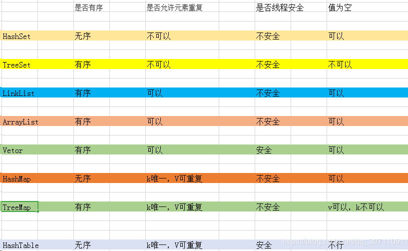

# 集合

## Collection父接口

特点：无序，无下标。

#### 方法

| 方法                  | 描述                                                |
| --------------------- | --------------------------------------------------- |
| boolean add(E e)      | 向集合中添加元素                                    |
| boolean remove(E e)   | 删除集合中的元素（成功返回true失败返回false)        |
| void clear()          | 清空集合的所有元素(无返回值)                        |
| boolean contains(E e) | 判断集合是否包含某元素(有则返回true，无则返回false) |
| boolean isEmapty()    | 判断集合是否为空(为空则返回true,不为空返回false)    |
| int size()            | 获取集合的长度并返回集合长度                        |
| Object[] toArray()    | 将集合返回为一个数组                                |

#### 遍历

##### 第一种，for each

```java 
Collection col = new ArrayList();
col.add("熊大");
col.add("熊二");
col.add("熊三");
for(Object obj : col){
    String str = (String)obj;
    System.out.println(str);
}
```

##### 第二种，迭代器

```java
Iterator it = col.iterator();
while(it.hasNext){
    Object obj = it.next();
    String str = (String)obj;
    System.out.println(str);
}
```

### List接口

#### 方法（特有）

| 方法                           | 描述                                                     |
| ------------------------------ | -------------------------------------------------------- |
| void add(int index, E element) | 将指定元素，添加到该集合中指定位置上                     |
| E get(int index)               | 返回集合中指定位置的元素                                 |
| E remove(int index)            | 移除列表中指定位置的元素，返回的是被移除的元素           |
| E set(int index, E element)    | 用指定元素替换集合中指定位置的元素，返回值是更新前的元素 |

#### List遍历

与Collection一致，可以使用for each，迭代器和for循环

```java
List list = new ArrayList();
list.add(1);
list.add(2);
list.add(3);
ListIterator listIt = list.listTterator();
while(listIt.hasNext()){
    Object obj = listIt.next();
    System.out.println("===" + (int)obj);
}
```

#### ArrayList

| 方法                                         | 描述                                                         |
| -------------------------------------------- | ------------------------------------------------------------ |
| int indexOf (Object o)                       | 返回此列表中首次出现的指定元素的索引，或如果此列表不包含元素，则返回 - 1 |
| int lastIndexOf (Object o)                   | 返回此列表中最后一次出现的指定元素的索引，或如果此列表不包含索引，则返回 - 1 |
| List subList ( int fromIndex, int toIndex)   | 根据起始索引和结束索引从集合中截取一段元素，放到一个新集合中 |
| void forEach (Consumer < ? super E > action) | 执行特定动作的每一个元素的 Iterable直到所有元素都被处理或操作抛出异常 |

subList()方法返回的是父集合的一部分视图，无论如何改变那个集合，另一个都会随之而动。

#### LinkedList

| 方法               | 描述                             |
| ------------------ | -------------------------------- |
| void addFirst(E e) | 将指定元素插入此列表的开头       |
| void addLast(E e)  | 将指定元素添加到此列表的结尾     |
| void push(E e)     | 将元素推入此列表所表示的堆栈     |
| E getFirst()       | 返回该列表的第一个元素           |
| E getLast()        | 返回该列表的最后一个元素         |
| E removeFirst()    | 移除并返回该列表的第一个元素     |
| E removeLast()     | 移除并返回此列表的最后一个元素   |
| boolean isEmpty()  | 如果列表中不包含元素，则返回true |



### Set接口

特点：无序，无下标。

## Map父接口

### HashMap