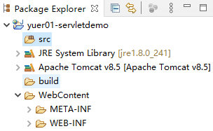
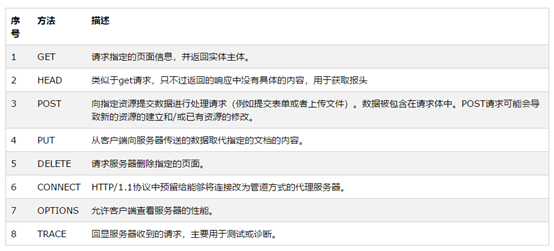

# Tomcat

Tomcat目录：

* bin：二进制目录，Tomcat程序运行时需要加载的二进制文件，也包含可执行文件
* **conf**：Tomcat的配置文件目录
* lib：Tomcat是Java开发，lib中包含Tomcat运行时需要加载的jar包工具
* logs：Tomcat运行日志文件夹
* temp：临时文件夹，一般用不上
* webapps：部署在Tomcat上的项目所在文件夹
* work：Javaweb应用启动后生成的工作目录，往往存放jsp的处理文件

# Servlet

Servlet无法独立运行，需要通过服务器接收到请求后再执行Servlet的程序来处理请求

* Servlet demo

  

  * src：放置Java代码

  * build：构建项目文件夹，程序员无需操作

  * WebContent：放置Web资源（比如HTML，CSS，JS，JSP，图片等其他多媒体资源）的目录
    * META-INF：项目元数据信息，程序员无需操作
    * WEB-INF：web项目相关信息及资源，包含lib文件夹（用于放置项目所需的jar包）
      * **web.xml：这是个web项目的入口文件，配置了web项目的各种信息，往往由Tomcat容器去读取web.xml，从而加载到web项目的信息**

## Servlet详解

### HTTP协议

* HTTP协议的组成部分

  * HTTP制定的是超文本传输协议，往往应用于互联网应用，互联网应用的功能分为请求与响应两个部分。

  * 请求分为四部分：请求头，请求行，请求正文，空行

    * 请求行：包含请求路径（url）

    * 请求头：包含请求方式，请求主机，客户端设定的接收的内容类型

    * 请求正文：包含请求的数据

    * 空行：表示请求头的内容结束了，用于分隔请求头和正文

    * HTTP的请求方式

      

  * 响应组成部分：响应行，响应头，响应正文

    * 响应行：主要包含响应状态码（响应状态码决定了响应的内容成功与否）
    * 响应头：包含响应的内容类型，编码格式等
    * 响应正文：包含响应的具体内容

### ServletAPI

* Servlet生命周期：

  * **初始化**：当浏览器想Servlet第一次发送请求时（或者配置了load-on-startup，从而使Servlet随着Tomcat容器的启动而启动），Tomcat会调用Servlet的初始化方法，完成对Servlet的初始化，一旦初始化完成，只要该Servlet没有被销毁，那么Tomcat不会再对Servlet进行初始化。即初始化方法只执行一次。
  * **销毁**：Servlet会在Tomcat服务器停止或者重新加载启动时被销毁。
  * **处理请求**：service方法是ServletAPI中提供给Tomcat处理请求的方法，GenericServlet本身提供了service方法用于接受请求并处理。用户可自定义service方法，实现个性化请求处理。而HTTP协议下有多种请求方式，所以在service的方法的基础上由HTTPServlet增加了HTTP协议的处理方式。
  * **处理流程**：请求交给service方法，由service方法根据请求本身的请求方式，调用用户的Servlet中doGet或doPost方法。

* Servlet中提供了ServletConfig接口，该接口中提供了Servlet配置信息的方法，包含对于Servlet初始化参数的操作，以及获取Servlet上下文对象（ServletContext）的方法

  ```xml
  <servlet>
    	<servlet-name>api</servlet-name>
    	<servlet-class>servlet.APIServlet</servlet-class>
    	<!-- 初始化参数，可以在servlet中预存一些常量，类似于预存的数据 -->
    	<init-param>
    		<param-name>username</param-name>
    		<param-value>admin</param-value>
    	</init-param>
    	<!-- load-on-startup表示随着容器启动而初始化，配置的值是数字，从1开始，数字越小，越先被初始化 -->
    	<load-on-startup>1</load-on-startup>
    </servlet>
  ```

  * ServletContext对象

    Servlet上下文对象，实际表示的是整个web项目，可以利用ServletContext实现长时间保存数据，（Servlet的其中一个作用域对象）
  
  * HTTPServletRequest对象
  
    HTTPServletRequest对象由tomcat接收到请求以后，组成HTTPServletRequest对象并放置在处理请求的service方法参数中
  
* Servlet的请求与响应

  * ServletAPI中提供了获取请求与完成响应的对象，分别为ServletRequest和ServletResponse，HttpServlet中提供了ServletRequest HttpServletRequest和ServletResponse的子接口，HttpServletResponse是针对于http协议下的请求与响应的对象，直接赋值给了doXXX()方法的参数中

  1. 请求与响应

     ```java
     //获取请求传递的数据（请求参数）
     String username = req.getParameter("username");
     String password = req.getParameter("password");
     //简单的响应,利用字符流，向浏览器响应字符
     PrintWriter pw = resp.getWriter();
     if(username.equals("chris") && password.equals("123")) {
         pw.write("<b>login success</b>");
     }else {
         pw.write("<b>login failed</b>");
     }
     pw.close();
     ```

  2. HttpServletRequest

     * HttpServletRequest对象可以获得一个请求中所有信息

     ```java
     //获取请求参数
     String username = req.getParameter("username");
     System.out.println(username);
     //HttpServletRequest对象提供的其他方法
     System.out.println("上下文路径：" + req.getContextPath());
     System.out.println("本地地址："+ req.getLocalAddr());
     System.out.println("本地端口：" + req.getLocalPort());
     System.out.println("请求头中的内容类型" + req.getContentType());
     System.out.println("请求方式：" + req.getMethod());
     System.out.println("获取请求遵守的协议：" + req.getProtocol());
     System.out.println("获取访问的servlet路径：" + req.getServletPath());
     ```

     * 重要的方法：**getContextPath()**用于获取上下文路径，**getMethod()**用于获取请求方式，**getServletPath()**用于获取Servlet访问路径

     * 常用的方法：获取请求参数**getParameter()** ，获取作用域数据**getAttribute()**

     获取多参数**getParameterValues()**

* get请求和post请求区别

  * get请求会将传递的参数显示到url路径上
  * post请求会将传递的参数，以简直对形式存储到请求体中
  * get请求一般用于查询操作，因为数据直接显示在url上，不应该直接传递增删改的数据
  * post请求往往用于传递增删改的数据
  * post相对get更安全
  * get请求能够传递的参数有大小限制，一般浏览器会限制到几kb
  * post请求传递的参数大小原则上无限制，所以上传文件一般是post请求

* HttpServletResponse

  * 响应和跳转页面

    ```java
    //获取打印对象，可使用对象的write()方法打印数据到页面
    PrintWrite pw = resp.getWrite();
    pw.write();
    pw.flush();
    pw.close();
    //跳转页面，页面重定向
    resp.sendRedirect("访问路径");
    ```

* 请求与响应的乱码处理

  * 乱码处理的前提：页面，项目，java代码的编码必须统一

  * get请求处理乱码

    * 由于get请求的参数放置在url上，路径的解析是交给服务器处理的，所以get请求的乱码处理需要配置服务器（Tomcat）

    * 配置Tomcat中的server.xml

      ```xml
      <Connector connectionTimeout="20000" port="8080" URIEncoding="UTF-8" protocol="HTTP/1.1" redirectPort="8443"/>
      ```

  * post请求处理乱码：

    ```java
    //post请求处理乱码，req.setCharacterEncoding仅对post请求有效
    //一定要放置在获取数据之前转码
    req.setCharacterEncoding("utf-8");
    ```

  * 响应处理乱码：

    ```java
    //防止在响应内容前
    resp.setContentType("text/html;charset=utf-8");
    ```

  * 注意：如果后端接收的数据未出现乱码，但是数据库中数据乱码，需要在数据库连接字符串部分增加编码处理

    ```properties
    jdbc:mysql://localhost:3306/数据库名?useUnicode=true&characterEncoding=utf8
    ```

### 请求转发和重定向

1. 请求转发

   * Servlet接收到请求后，可以将该请求转发给其他资源（Servlet，jsp，html），Servlet和jsp是可以接收和转发数据的，但是html无法接收，所以一般请求转发都是转发给Servlet和jsp

   * request.getRequestDispatcher返回了RequestDispatcher对象，通过该对象实现将请求转发给某个资源

     ```java
     //getRequestDispatcher返回值RequestDispatcher，参数是要转发给某个资源的路径
     RequestDispatcher rd = req.getRequestDispatcher("login2");
     //转发过去
     rd.forward(req, resp);
     rd.include(req,resp);
     ```

     * includ和forward的区别
       1. 都能实现请求转发，都能传递数据给另一个资源
       2. forward是所有响应内容都交由转发对象处理，include是响应内容，由本身的Servlet及转发的Servlet共同响应给浏览器

   * 请求转发的特点

     * 一个请求可能由多个Servlet处理
     * 在客户端路径地址栏上只保留发送请求的路径，然后由浏览器向这个路径发送请求（一次请求）

2. 请求重定向

   ```java
   response.sendRedirct("路径");
   ```

   * 相当于向浏览器重新发送一个路径，然后由浏览器向这个路径发送请求，**请求重定向会发送至少两次请求**

* 请求转发和请求重定向的区别：
  1.  请求转发在浏览器端只有一次请求，请求重定向至少两次请求
  2.  请求转发是可以将数据传递给另一个资源，但是请求重定向不可以。
  3. 请求转发会根据当前请求的请求方式调用另一个资源的doGet或者doPost方法，重定向无论是什么请求方式都会调用另一个资源的doGet方法。
  4. 请求转发和请求重定向编写相对路径时是相同的，编写了绝对路径（路径前加/），请求转发路径从项目名开始，请求重定向从服务器路径（localhost:8080）开始。

### Cookie和Session

#### Cookie

服务器响应给浏览器端，并在浏览器端可以长时间保留的数据（基于HTTP标准的）

* 使用：

  * 服务器端将数据存储到浏览器端

    	```java
  	//创建cookie对象
  	Cookie cookie = new Cookie("username", "admin");
  	resp.addCookie(cookie);
  resp.sendRedirect("success.html");
    ```

* 服务器端将cookie响应给浏览器，默认的有效时间是从创建开始到浏览器关闭。

* 请求转发和重定向都可以将cookie响应给浏览器

* 设置cookie存储在浏览器中的有效时间

  ```java
  Cookie cookie = new Cookie("username", "admin");
  //设置cookie的有效时间（单位是秒），参数为正数时，设置具体的有效时间；设置为0时相当于删除cookie（不保留cookie），负数时，为默认有效时间（浏览器关闭时结束）
  cookie.setMaxAge(30);
  resp.addCookie(cookie);
  resp.sendRedirect("success.html");
  ```

* cookie可以实现同一服务器不同Servlet之间进行数据共享

  ```java
  Cookie[] cookies = req.getCookies();
  for(Cookie c : cookies){
      System.out.println(c.getName());
  	System.out.println(c.getValue());
  }
  ```


#### Session

表示浏览器和服务器之间的一次回话，可以在session中存储数据。存储在服务端（保存服务器和客户端的一次会话）

# Filter

使用getRequestURL屏蔽掉login.html和register.html

```java
String path = request.getRequestUrl();
```

