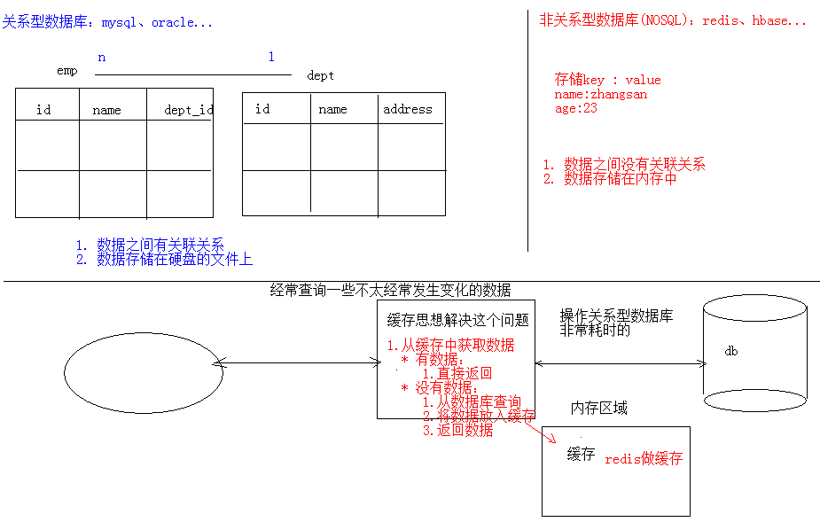
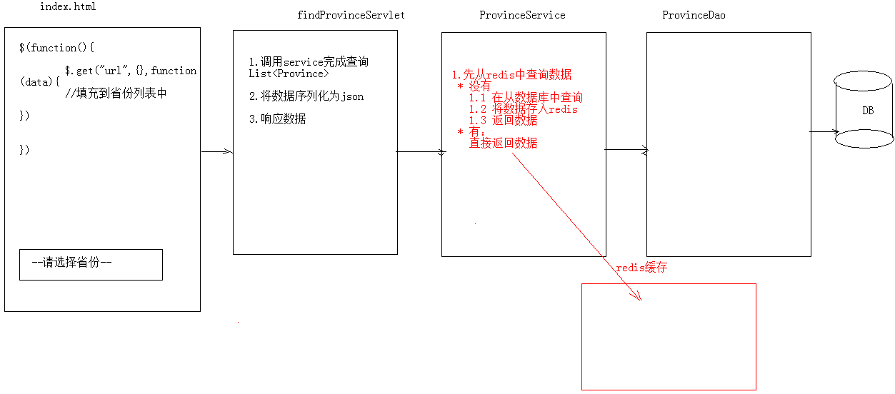
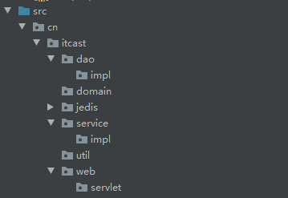
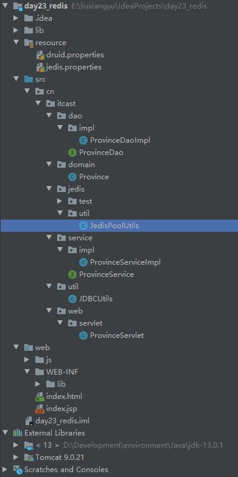

# Redis

### 1. 概念

* redis是一款高性能的NOSQL系列的非关系型数据库

* 关系型数据库：masql、oracle

  * 数据之间有关联
  * 数据存储在硬盘

* 非关系型数据库(NOSQL)：redis、hbase

  * 数据之间没有关联关系
  * 数据存储在内存中

  

* 1.1.什么是NOSQL
    NoSQL(NoSQL = Not Only SQL)，意即“不仅仅是SQL”，是一项全新的数据库理念，泛指非关系型的数据库。
<<<<<<< HEAD
    随着互联网web2.0网站的兴起，传统的关系数据库在应付web2.0网站，特别是超大规模和高并发的SNS类型的web2.0纯动态网站已经显得力不从心，暴露了很多难以克服的问题，而非关系型的数据库则由于其本身的特点得到了非常迅速的发展。NoSQL数据库的产生就是为了解决大规模数据集合多重数据种类带来的挑战，尤其是大数据应用难题。

      		* 1.1.1.	NOSQL和关系型数据库比较
            
=======
    		随着互联网web2.0网站的兴起，传统的关系数据库在应付web2.0网站，特别是超大规模和高并发的SNS类型的web2.0纯动态网站已经显得力不从心，暴露了很多难以克服的问题，而非关系型的数据库则由于其本身的特点得到了非常迅速的发展。NoSQL数据库的产生就是为了解决大规模数据集合多重数据种类带来的挑战，尤其是大数据应用难题。

      		* 1.1.1.	NOSQL和关系型数据库比较
            		  			* 优点：
           * 1）成本：nosql数据库简单易部署，基本都是开源软件，不需要像使用oracle那样花费大量成本购买使用，相比关系型数据库价格便宜。
           * 2）查询速度：nosql数据库将数据存储于缓存之中，关系型数据库将数据存储在硬盘中，自然查询速度远不及nosql数据库。
           * 3）存储数据的格式：nosql的存储格式是key,value形式、文档形式、图片形式等等，所以可以存储基础类型以及对象或者是集合等各种格式，而数据库则只支持基础类型。
                		    * 4）扩展性：关系型数据库有类似join这样的多表查询机制的限制导致扩展很艰难。
                    		      			  	
           
                   		  * 缺点：
           * 1）维护的工具和资料有限，因为nosql是属于新的技术，不能和关系型数据库10几年的技术同日而语。
           * 2）不提供对sql的支持，如果不支持sql这样的工业标准，将产生一定用户的学习和使用成本。
           * 3）不提供关系型数据库对事务的处理。
                		      			  	
           		* 1.1.2.	非关系型数据库的优势：
             * 1）性能NOSQL是基于键值对的，可以想象成表中的主键和值的对应关系，而且不需要经过SQL层的解析，所以性能非常高。
              		  * 2）可扩展性同样也是因为基于键值对，数据之间没有耦合性，所以非常容易水平扩展。
          
>>>>>>> remotes/mdnote/master
       * 1.1.3.	关系型数据库的优势：
            * 1）复杂查询可以用SQL语句方便的在一个表以及多个表之间做非常复杂的数据查询。
            * 2）事务支持使得对于安全性能很高的数据访问要求得以实现。对于这两类数据库，对方的优势就是自己的弱势，反之亦然。
            		* 1.1.4.	总结
    
        		  			  			关系型数据库与NoSQL数据库并非对立而是互补的关系，即通常情况下使用关系型数据库，在适合使用NoSQL的时候使用NoSQL数据库，
        		    			让NoSQL数据库对关系型数据库的不足进行弥补。
        		    			一般会将数据存储在关系型数据库中，在nosql数据库中备份存储关系型数据库的数据


* 1.2.主流的NOSQL产品
  			
  * 键值(Key-Value)存储数据库
    			* 相关产品： Tokyo Cabinet/Tyrant、Redis、Voldemort、Berkeley DB
    * 典型应用： 内容缓存，主要用于处理大量数据的高访问负载。 
    * 数据模型： 一系列键值对
    * 优势： 快速查询
    * 劣势： 存储的数据缺少结构化
  * 列存储数据库
    			* 相关产品：Cassandra, HBase, Riak
    * 典型应用：分布式的文件系统
    * 数据模型：以列簇式存储，将同一列数据存在一起
    * 优势：查找速度快，可扩展性强，更容易进行分布式扩展
    * 劣势：功能相对局限
  * 文档型数据库
    			* 相关产品：CouchDB、MongoDB
    * 典型应用：Web应用（与Key-Value类似，Value是结构化的）
    * 数据模型： 一系列键值对
    * 优势：数据结构要求不严格
    * 劣势： 查询性能不高，而且缺乏统一的查询语法
  * 图形(Graph)数据库
    			* 相关数据库：Neo4J、InfoGrid、Infinite Graph
    * 典型应用：社交网络
    * 数据模型：图结构
    * 优势：利用图结构相关算法。
    * 劣势：需要对整个图做计算才能得出结果，不容易做分布式的集群方案。
  
* 1.3 什么是Redis
  			
  * Redis是用C语言开发的一个开源的高性能键值对（key-value）数据库，官方提供测试数据，50个并发执行100000个请求,读的速度是110000次/s,写的速度是81000次/s ，且Redis通过提供多种键值数据类型来适应不同场景下的存储需求，目前为止Redis支持的键值数据类型如下：
    			* 1) 字符串类型 string
    * 2) 哈希类型 hash
    * 3) 列表类型 list
    * 4) 集合类型 set
    * 5) 有序集合类型 sortedset
  * 1.3.1 redis的应用场景
    			* 缓存（数据查询、短连接、新闻内容、商品内容等等）
    * 聊天室的在线好友列表
    * 任务队列。（秒杀、抢购、12306等等）
    * 应用排行榜
    * 网站访问统计
    * 数据过期处理（可以精确到毫秒
    * 分布式集群架构中的session分离

### 2. 下载安装

1. 官网：http://redis.io
2. 中文网：http://www.redis.net.cn
3. 安装教程：https://www.redis.net.cn/tutorial/3503.html
4. 解压即可使用:
   * redis.windows.conf：配置文件
   * redis-cli.exe：redis的客户端
   * redis-sercer.exe：redis服务端

### 3. 命令操作

1. redis的数据结构：

   * redis存储的是：`key,value`格式的数据，其中key都是字符串，value有5中不同的数据结构
     * value的数据结构：
       * 1) 字符串类型 string：
       * 2) 哈希类型 hash：map格式
       * 3) 列表类型 list：linkedlist格式，支持重复元素
       * 4) 集合类型 set：不允许重复元素
       * 5) 有序集合类型 sortedset：不允许重复元素，且元素有顺序

   

2. 字符串类型 String

   1. 存储：`set key value`
   2. 获取：`get key`
   3. 删除：`del key`

3. 哈希类型 hash

   1. 存储：`hset key field value`
   2. 获取：
      * `hget key field`：获取指定的field对应的值
      * `hgetall key`：获取所有的field和value
   3. 删除：`hdel key field`

4. 列表类型 list：可以添加一个元素到列表的左边或者右边

   1. 添加：

      * `lpush key value`：将元素加入到列表左边

      * `rpush key value`：将元素加入到列表右边

   2. 获取：

      * `lrange key statr end`：获取范围数据

   3. 删除：

      * `lpop key`：删除列表最左边的元素，并将元素返回
      * `rpop key`：删除列表最右边的元素，并将元素返回

5. 集合类型 set：不允许重复元素

   1. 存储：`sadd key value1 value2 value3 `
   2. 获取：`smembers key`：获取set集合中所有元素
   3. 删除：`srem key value`：删除set集合中的某一个元素

6. 有序集合 sortset：不允许重复元素，且元素有顺序（可用作热搜榜，排行榜）

   1. 存储：`zadd key score value`：根据score值排序
   2. 获取：
      * `zrange key start end`：获取范围数据
      * `zrange key start end withscore`：获取范围数据和分数
   3. 删除：`zrem key value`

7. 通用命令：

   1. `keys *`：查询所有键
   2. `type key`：获取键对应value的类型
   3. `del key`：删除指定的key,value

### 4.  持久化

1. redis是一个内存数据库，当redis服务器重启，或者电脑重启，数据会丢失，我们可以将redis内存中的数据持久化保存到硬盘的文件中。

2. redis持久化机制：

   1. RDB：默认方式，无需配置，默认使用当前机制

      * 在一定间隔时间中，检测key的变化情况，然后持久化数据

      1. 编辑redis.conf文件：

         ```conf
         #   after 900 sec (15 min) if at least 1 key changed
         save 900 1
         #   after 300 sec (5 min) if at least 10 keys changed
         save 300 10
         #   after 60 sec if at least 10000 keys changed
         save 60 10000
         ```

      2. 重新启动redis服务器，并指定配置文件名称

         ```cmd
         D:\Development\redis-2.4.5-win64>redis-server.exe redis.conf
         ```

   2. AOF：日志记录的方式，可以记录每一条命令的操作

      * 每一命令操作后，持久化数据

      1. 编辑redis.conf文件：

         ```conf
         appendonly no（关闭AOF）-->appendonly yes（开启AOF）
         
         # appendfsync always	：每一次操作都进行持久化
         appendfsync everysec	：每隔一秒进行一次持久化
         # appendfsync no		：不进行持久化
         ```

### 5. Java客户端：Jedis

* Jedis：一款Java操作redis数据库的工具

* 使用步骤：

  1. 下载Jedis的Jar包

  2. 使用

     ```java
         @Test
         public void test1(){
             // 1. 获取连接
             // Jedis jedis = new Jedis();//默认值为"localhost",6379
             Jedis jedis = new Jedis("localhost", 6379);
             // 2. 操作
             jedis.set("username", "zhangsan");
             // 3. 关闭连接
             jedis.close();
         }
     ```

* Jedis操作各种redis中的数据结构

  * 1) 字符串类型 string：
    * set
    * get
  * 2) 哈希类型 hash：map格式
    * hset
    * hget
  * 3) 列表类型 list：linkedlist格式，支持重复元素
    * lpush/rpush
    * lpop/rpop
  * 4) 集合类型 set：不允许重复元素
    * sadd
  * 5) 有序集合类型 sortedset：不允许重复元素，且元素有顺序
    * zadd
  
  ```java
      /**
      * 快速入门
      */
      @Test
      public void test1(){
          // 1. 获取连接
          Jedis jedis = new Jedis("localhost", 6379);
          // 2. 操作
          jedis.set("username", "zhangsan");
  
          // 3. 关闭连接
          jedis.close();
      }
      /**
      * String 数据结构操作
      */
      @Test
      public void test2(){
          // 1. 获取连接
          Jedis jedis = new Jedis();//默认值为"localhost",6379
          // 2. 操作
          jedis.set("username", "zhangsan");
          // 获取
          String username = jedis.get("username");
          System.out.println(username);
  
          // 可以使用setex()方法存储可以指定过期时间的key value
          jedis.setex("activecode", 20, "hehe");
          // 将activecode：hehe键值对存入redis，并且20秒后自动删除该键值对
          // 用作验证码，激活码等。
  
          // 3. 关闭连接
          jedis.close();
      }
      /**
      * hash 数据结构操作
      */
      @Test
      public void test3(){
          // 1. 获取连接
          Jedis jedis = new Jedis("localhost", 6379);
          // 2. 操作
          // 存储hash
          jedis.hset("user", "name", "lisi");
          jedis.hset("user", "age", "23");
          jedis.hset("user", "gender", "female");
  
          // 获取hash
          String name = jedis.hget("user", "name");
          System.out.println(name);
  
          //获取hash所有map数据
          Map<String, String> user = jedis.hgetAll("user");
  
          // keyset
          Set<String> keySet = user.keySet();
          for (String key : keySet) {
              // 获取value
              String value = user.get(key);
              System.out.println(value);
          }
  
          // 3. 关闭连接
          jedis.close();
      }
      /**
      * list 数据结构操作
      */
      @Test
      public void test4(){
          // 1. 获取连接
          Jedis jedis = new Jedis();//默认值为"localhost",6379
          // 2. 操作
          // list 存储
          /* jedis.lpush("mylist", "a", "b", "c");// 从左边存
              jedis.rpush("mylist", "a", "b", "c");// 从右边存*/
  
          // list的范围获取
          List<String> mylist = jedis.lrange("mylist", 0, -1);
          System.out.println(mylist);
  
          String element1 = jedis.lpop("mylist");
          System.out.println(element1);
          String element2 = jedis.rpop("mylist");
          System.out.println(element2);
          List<String> mylist1 = jedis.lrange("mylist", 0, -1);
          System.out.println(mylist1);
          // 3. 关闭连接
          jedis.close();
      }
      /**
      * set 数据结构操作
      */
      @Test
      public void test5(){
          // 1. 获取连接
          Jedis jedis = new Jedis();//默认值为"localhost",6379
          // 2. 操作
          jedis.sadd("mySet", "java", "php", "c++");
  
          // set获取
          Set<String> mySet = jedis.smembers("mySet");
          System.out.println(mySet);
  
          // 3. 关闭连接
          jedis.close();
      }
      /**
      * set 数据结构操作
      */
      @Test
      public void test6(){
          // 1. 获取连接
          Jedis jedis = new Jedis();//默认值为"localhost",6379
          // 2. 操作
          jedis.zadd("mySortedSet", 3, "亚瑟");
          jedis.zadd("mySortedSet", 30, "后裔");
          jedis.zadd("mySortedSet", 55, "孙悟空");
          // set获取
          Set<String> mySortedSet = jedis.zrange("mySortedSet", 0, -1);
          System.out.println(mySortedSet);
  
          // 3. 关闭连接
          jedis.close();
      }
  ```
  
* jedis连接池：JedisPool

  * 使用：

    1. 创建JedisPool连接池对象
    2. 调用方法`getResource()`方法获取Jedis连接

    ```java
        /**
        * jedis连接池的使用
        */
        @Test
        public void test7(){
            // 0. 创建一个配置对象
            JedisPoolConfig config = new JedisPoolConfig();
            config.setMaxTotal(50);
            config.setMaxIdle(10);
    
            // 1. 创建Jedis连接池对象
            JedisPool jedisPool = new JedisPool(config, "localhost", 6379);
    
            // 2. 获取连接
            Jedis jedis = jedisPool.getResource();
    
            // 3. 使用
            jedis.set("hehe", "heihei");
    
            // 4. 关闭 归还到连接池中
            jedis.close();
        }
    ```

  * JedisUtils工具类

    ```java
    import redis.clients.jedis.Jedis;
    import redis.clients.jedis.JedisPool;
    import redis.clients.jedis.JedisPoolConfig;
    
    import java.io.IOException;
    import java.io.InputStream;
    import java.util.Properties;
    
    **
     * JedisPool 工具类
     * 加载配置文件，配置连接池的参数
     * 提供获取连接的方法
     */
    public class JedisPoolUtils {
        static {
            // 读取配置文件
            InputStream resourceAsStream = JedisPoolUtils.class.getClassLoader().getResourceAsStream("jedis.properties");
            // 创建Properties对象
            Properties properties = new Properties();
            // 关联文件
            try {
                assert resourceAsStream != null;
                properties.load(resourceAsStream);
            } catch (IOException e) {
                e.printStackTrace();
            }
            // 获取数据，设置到JedisPoolConfig中
            JedisPoolConfig config = new JedisPoolConfig();
            config.setMaxTotal(Integer.parseInt(properties.getProperty("maxTotal")));
            config.setMaxIdle(Integer.parseInt(properties.getProperty("maxIdle")));
            // 初始化JedisPool
            jedisPool = new JedisPool(config, properties.getProperty("host"), Integer.parseInt(properties.getProperty("port")));
        }
    
        private static JedisPool jedisPool;
        /**
         * 获取连接方法
         * @return Jedis jedisPool.getResource()
         */
        public static Jedis getJedis(){
            return jedisPool.getResource();
        }
    }
    ```

  * JedisUtils测试

    ```java
    	/**
         * jedis 连接池工具类的使用
         */
        @Test
        public void test8(){
    
            // 通过连接池工具类获取
            Jedis jedis = JedisPoolUtils.getJedis();
    
            // 3. 使用
            jedis.set("hello", "world");
    
            // 4. 关闭 归还到连接池中
            jedis.close();
        }
    ```

    

### 案例

* 案例需求：
  1. 提供index页面，页面中有一个省份下拉列表
  2. 当页面完成后，发送ajax请求，加载所有省份



* 注意：使用redis缓存一些不经常发生变化的数据。
  * 数据库一旦发生改变，则需要更新缓存
    * 数据库的表执行过增删改相关的操作，需要将redis缓存数据再次存入
    * 在service对应的增删改方法中，将redis数据删除


* 详细步骤：

  1. 创建数据库

     ```mysql
     # 创建数据库
     CREATE DATABASE day23;
     
     # 使用数据库
     USE day23;
     
     # 创建表
     CREATE TABLE province ( id INT PRIMARY KEY AUTO_INCREMENT, NAME VARCHAR ( 20 ) NOT NULL );
     
     # 插入数据
     INSERT INTO province VALUES(NULL, '北京');
     INSERT INTO province VALUES(NULL, '上海');
     INSERT INTO province VALUES(NULL, '广州');
     INSERT INTO province VALUES(NULL, '陕西');
     ```

  2. 搭建环境

     1. 导入jar包

        

     2. 创建包

        

     3. 导入配置文件

        

     4. 导入工具类`JdbcUtils.java`

        ```java
        import com.alibaba.druid.pool.DruidDataSourceFactory;
        
        import javax.sql.DataSource;
        import java.io.InputStream;
        import java.sql.Connection;
        import java.sql.SQLException;
        import java.util.Properties;
        
        /**
         * JDBC工具类 使用Durid连接池
         */
        public class JDBCUtils {
        
            private static DataSource ds;
        
            static {
        
                try {
                    //1.加载配置文件
                    Properties pro = new Properties();
                    //使用ClassLoader加载配置文件，获取字节输入流
                    InputStream is = JDBCUtils.class.getClassLoader().getResourceAsStream("druid.properties");
                    assert is != null;
                    pro.load(is);
        
                    //2.初始化连接池对象
                    ds = DruidDataSourceFactory.createDataSource(pro);
        
                } catch (Exception e) {
                    e.printStackTrace();
                }
            }
        
            /**
             * 获取连接池对象
             */
            public static DataSource getDataSource() {
                return ds;
            }
        
        
            /**
             * 获取连接Connection对象
             */
            public static Connection getConnection() throws SQLException {
                return ds.getConnection();
            }
        ```
     
        
     
     5. `domain.Province.java`
     
        ```java
        package cn.itcast.domain;
        
        public class Province {
            private int id;
            private String name;
        
            public int getId() {
                return id;
            }
        
            public void setId(int id) {
                this.id = id;
            }
        
            public String getName() {
                return name;
            }
        
            public void setName(String name) {
                this.name = name;
            }
        }
        ```
     
     6. 查询数据库的Dao接口`ProvinceDao.java`和它的实现类`ProvinceDaoImpl.java`
     
        ```java
        package cn.itcast.dao;
        
        import cn.itcast.domain.Province;
        
        import java.util.List;
        
        public interface ProvinceDao {
            List<Province> findAll();
        }
        ```
     
        ```java
        package cn.itcast.dao.impl;
        
        import cn.itcast.dao.ProvinceDao;
        import cn.itcast.domain.Province;
        import cn.itcast.util.JDBCUtils;
        import org.springframework.jdbc.core.BeanPropertyRowMapper;
        import org.springframework.jdbc.core.JdbcTemplate;
        
        import java.util.List;
        
        public class ProvinceDaoImpl implements ProvinceDao {
        
            // 声明一个成员变量 JdbcTemplate template
        
            private JdbcTemplate template = new JdbcTemplate(JDBCUtils.getDataSource());
        
            @Override
            public List<Province> findAll() {
                // 1. 定义SQL
                String sql = "select * from day23.province";
                // 2. 执行SQL
                return template.query(sql, new BeanPropertyRowMapper<Province>(Province.class));
            }
        }
        ```
     
     7. 服务类接口`PrivinceService.java`和它的实现`PrivinceServiceImpl.java`
     
        ```java
        package cn.itcast.service;
        
        import cn.itcast.domain.Province;
        
        import java.util.List;
        
        public interface ProvinceService {
            List<Province> findAll();
            String findAllJson();
        }
        ```
     
        ```java
        package cn.itcast.service.impl;
        
        import cn.itcast.dao.ProvinceDao;
        import cn.itcast.dao.impl.ProvinceDaoImpl;
        import cn.itcast.domain.Province;
        import cn.itcast.jedis.util.JedisPoolUtils;
        import cn.itcast.service.ProvinceService;
        import com.fasterxml.jackson.core.JsonProcessingException;
        import com.fasterxml.jackson.databind.ObjectMapper;
        import redis.clients.jedis.Jedis;
        
        import java.util.List;
        
        public class ProvinceServiceImpl implements ProvinceService {
            // 声明dao
            private ProvinceDao dao = new ProvinceDaoImpl();
        
            @Override
            public List<Province> findAll() {
                return dao.findAll();
            }
        
            /**
             * 使用缓存
             *
             * @return String province_json
             */
            @Override
            public String findAllJson() {
                // 1. 先从redis中查询数据
                // 1.1 获取redis客户端连接
                Jedis jedis = JedisPoolUtils.getJedis();
                String province_json = jedis.get("province");
        
                // 2. 判断province_json数据是否为null
                if (province_json == null || province_json.length() == 0) {
                    // redis中没有数据
                    System.out.println("redis中没有数据，查询数据库");
                    // 2.1 从数据库中查询
                    List<Province> ps = dao.findAll();
                    // 2.2 将list序列化为json
                    ObjectMapper mapper = new ObjectMapper();
                    try {
                        province_json = mapper.writeValueAsString(ps);
                    } catch (JsonProcessingException e) {
                        e.printStackTrace();
                    }
        
                    // 2.3 将json数据存入rides中
                    jedis.set("province", province_json);
                    //归还连接
                    jedis.close();
                } else {
                    System.out.println("redis中有数据，查询缓存");
                }
        
                return province_json;
            }
        }
        ```
     
     8. Servlet`ProvinceServlet`
     
        ```java
        package cn.itcast.web.servlet;
        
        import cn.itcast.service.ProvinceService;
        import cn.itcast.service.impl.ProvinceServiceImpl;
        
        import javax.servlet.ServletException;
        import javax.servlet.annotation.WebServlet;
        import javax.servlet.http.HttpServlet;
        import javax.servlet.http.HttpServletRequest;
        import javax.servlet.http.HttpServletResponse;
        import java.io.IOException;
        
        @WebServlet("/provinceServlet")
        public class ProvinceServlet extends HttpServlet {
            protected void doPost(HttpServletRequest request, HttpServletResponse response) throws ServletException, IOException {
                /*// 1. 调用service查询
                ProvinceService service = new ProvinceServiceImpl();
                List<Province> list = service.findAll();
                // 2. 序列化list为json
                ObjectMapper mapper = new ObjectMapper();
                String json = mapper.writeValueAsString(list);*/
        
                // 1. 调用service查询
                ProvinceService service = new ProvinceServiceImpl();
                String json = service.findAllJson();
                System.out.println(json);
                // 3. 响应结果
                response.setContentType("application/json;charset=utf-8");
                response.getWriter().write(json);
            }
        
            protected void doGet(HttpServletRequest request, HttpServletResponse response) throws ServletException, IOException {
                this.doPost(request, response);
            }
        }
        ```
     
     9. `index.html`
     
        ```java
        <!DOCTYPE html>
        <html lang="zh">
        <head>
            <meta charset="UTF-8">
            <title>Title</title>
            <script type="text/javascript" src="js/jquery-3.3.1.min.js"></script>
            <script type="text/javascript">
                $(function () {
                    //发送ajax请求，加载所有省份的数据
                    $.get("provinceServlet", {}, function (data) {
                        // [{"id":1,"name":"北京"},{"id":2,"name":"上海"},{"id":3,"name":"广州"},{"id":4,"name":"陕西"}]
                        // 1. 获取select
                        let province = $("#province");
                        // 2. 遍历json数组
                        $(data).each(function () {
                            // 3. 创建<option>
                            let option = "<option name='" + this.id + "' >" + this.name + "</option>";
                            // 4. 调用select的append追加option
                            province.append(option);
                        });
        
                    });
                })
            </script>
        </head>
        <body>
        <label for="province"><select id="province">
            <option>--请选择省份--</option>
        </select>
        </label>
        </body>
        </html>
        ```
     
     10. `JdeisUtils.java`
     
         ```java
         package cn.itcast.jedis.util;
         
         import redis.clients.jedis.Jedis;
         import redis.clients.jedis.JedisPool;
         import redis.clients.jedis.JedisPoolConfig;
         
         import java.io.IOException;
         import java.io.InputStream;
         import java.util.Properties;
         
         /**
          * JedisPool 工具类
          * 加载配置文件，配置连接池的参数
          * 提供获取连接的方法
          */
         public class JedisPoolUtils {
             static {
                 // 读取配置文件
                 InputStream resourceAsStream = JedisPoolUtils.class.getClassLoader().getResourceAsStream("jedis.properties");
                 // 创建Properties对象
                 Properties properties = new Properties();
                 // 关联文件
                 try {
                     assert resourceAsStream != null;
                     properties.load(resourceAsStream);
                 } catch (IOException e) {
                     e.printStackTrace();
                 }
                 // 获取数据，设置到JedisPoolConfig中
                 JedisPoolConfig config = new JedisPoolConfig();
                 config.setMaxTotal(Integer.parseInt(properties.getProperty("maxTotal")));
                 config.setMaxIdle(Integer.parseInt(properties.getProperty("maxIdle")));
                 // 初始化JedisPool
                 jedisPool = new JedisPool(config, properties.getProperty("host"), Integer.parseInt(properties.getProperty("port")));
             }
         
             private static JedisPool jedisPool;
             /**
              * 获取连接方法
              * @return Jedis jedisPool.getResource()
              */
             public static Jedis getJedis(){
                 return jedisPool.getResource();
             }
         }
         ```
     
     11. 最终案例结构
     
         

